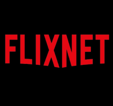

# Flixnet
Una página para series y peliculas de verdad.

## ¿Que permite Flixnet?
* **Podrás alquilar dvd de series y peliculas.**
* **Recibirlas virtualmente o en físico.**
* **Podrás compartir la cuenta hasta con cuatro usuarios**

## Creador
El creador de este proyeco es Manuel López, Alumno de 2ºDaw

**¿Como puedo acceder a Flixnet?:**
* A través de tu telefono movil
* A través de tu ordenador o portatil

**¿Que hemos usado para programar Flixnet?:**
* Javascript
* Flask
* Php
* Html
* Css

## Contribuciones
Las contribuciones son bienvenidas! Por favor, abre un issue para discutir nuevas características.

## Licencia

 
[Este es el enlace a nuestro github](https://github.com/mlopmai/Flixnet/edit/main/README.md)

## Precios

| Plan | Características | Precio mensual |
|---|---|---|
| Básico | 2 series y 2 peliculas | $5 |
| Estándar | 4 series y 4 peliculas | $10 |
| Premium | 8 series y 8 peliculas, además, las peliculas y series virtuales son sin limites | $50 |

if (codigo){
no hay codigo
}
